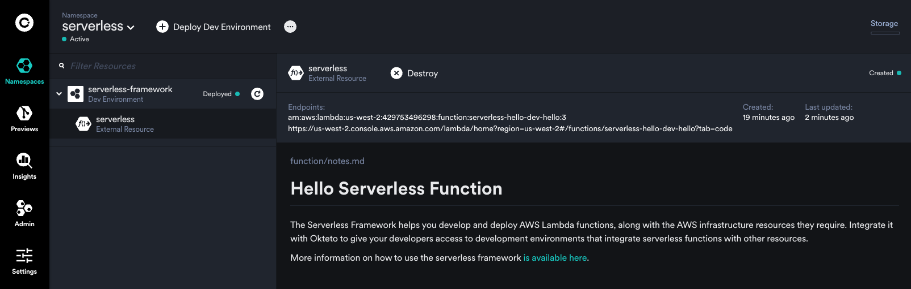

# Deploying AWS Lambda Functions on Okteto with serverless framework

This guide and sample app are meant to show how you can deploy [AWS Lambda Functions](https://docs.aws.amazon.com/lambda/latest/dg/welcome.html) as [External Resources](https://www.okteto.com/docs/tutorials/external-resources/) on [Okteto](https://www.okteto.com/) with the help of [serverless framework](https://www.serverless.com//).

This sample deploys a Lambda function that’s a simple Nodejs function. The deployed function listens at events and responds with a message: `"Go Serverless! Go Okteto!"`.

## Steps To Run This

1.  Configure your AWS Credentials in Okteto. You can use (https://www.okteto.com/docs/admin/cloud-credentials/aws-cloud-credentials/) so that Okteto can create resources in your AWS account. Make sure to give the following permissions to the [IAM role you create](https://www.okteto.com/docs/admin/cloud-credentials/aws-cloud-credentials/#step-2-create-the-iam-role-and-grant-access-to-s3) during the Cloud Credentials setup. This will enable every developer on your team to create AWS Lambda functions without requiring personal credentials.

    - AWSCloudFormationFullAccess
    - IAMFullAccess
    - AWSLambda_FullAccess
    - AmazonAPIGatewayAdministrator
    - AmazonS3FullAccess

You can also set up your AWS credentials as Admin Variables. You need to set the following:
- `AWS_REGION`
- `AWS_ACCESS_KEY`
- `AWS_ACCESS_SECRET_KEY`

1. Create an Access Key on your serverless account. Save it as an [Admin Variable](https://www.okteto.com/docs/admin/dashboard/#admin-variables) in Okteto using the name `SERVERLESS_ACCESS_KEY`.
1.  Run `okteto deploy` to spin up your development environment as part of which the lambda function and all the necessary resources would automatically be created for your developers.

## Test the function
Once the function has been deployed, you can run the `okteto test` command to validate that the function was correctly deployed. Since the test is running in Okteto, you don't need any local configuration other than setting up your `okteto context`.

## Benefits of Using Okteto and serverlessf framework:

1. Okteto allows you to deploy and manage serverless functions as external resources, providing a seamless development experience. You don't have to configure access to an AWS account for each developer and manage hacky solutions to provision Lambda Functions for developers when they need them during development.

1. Okteto gives you full control of the lifecycle of the AWS resources. When developers on your team delete the dev environment (or [Okteto's Garbage Collector](https://www.okteto.com/docs/admin/cleanup/) does it automatically for you after it's not in use), the AWS resources are also cleaned up!

1. serverless framework gives you full control over the AWS resources you want to provision, making it a versatile tool for defining infrastructure as code.

1. By combining Okteto with serverless framework, developers can easily develop applications that require Lambda functions without needing to configure the AWS infrastructure manually.
